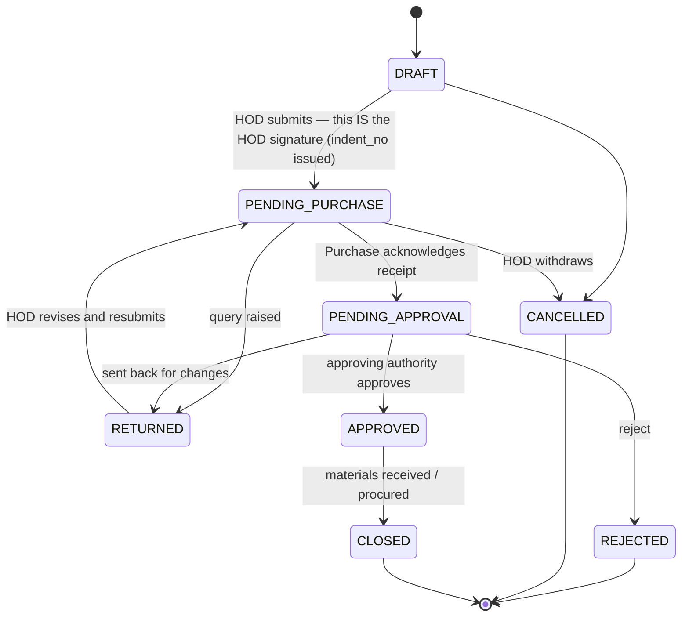
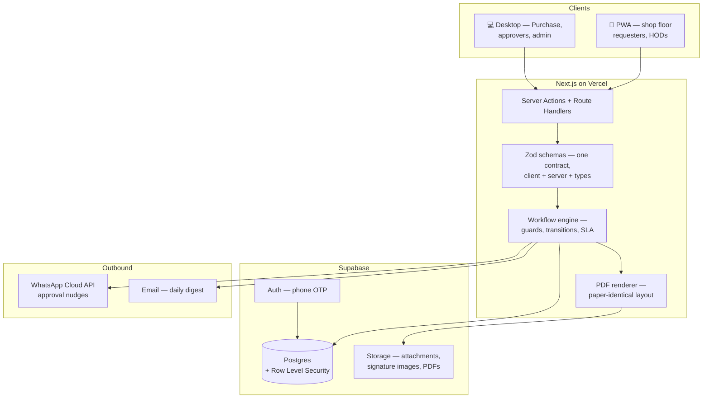
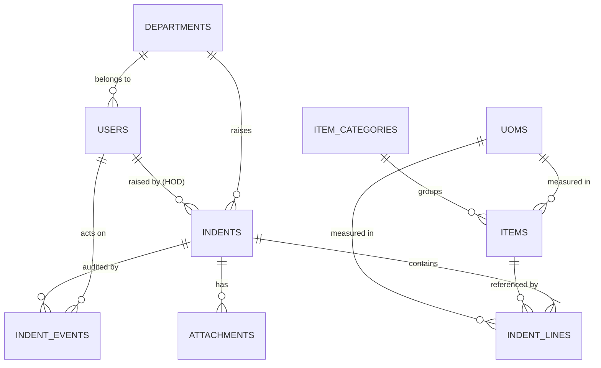

# Purchase Indent System — Architecture

**Marudhar Quartz Surfaces Pvt. Ltd. · Mahindra World City SEZ, Jaipur**

Replacing the pre-printed carbon-copy indent book (currently at serial **952**) with a
mobile-first workflow app.

---

## 1. Reading the paper form

The form is three things stacked on one sheet:

| Block | Paper | What it really is |
|---|---|---|
| Header | Serial No., Date, Indent No., Requester, Designation, Department, Signature | **Identity** of the request |
| Table | S.No. · Description of ITEM · UOM · Balance Qty · Required Qty (12 rows) | **Payload** — the line items |
| Footer | Remarks/Purpose, Expected Date, HOD sign, Received by Purchase, Approved by | **The approval chain** |

The third block is the whole point. **The form is not a document — it is a workflow whose
current state is encoded in which signature boxes happen to be filled in.** Anyone can
digitalize the fields in an afternoon; digitalizing the state machine is the actual product.

> **Superseded — there is no sign-in at all.**
>
> This document originally specified authenticated HODs, with the HOD's submit standing in
> for their signature. That was replaced on the customer's instruction: the tool is internal
> and rotates among two or three people who all do every job, so **accounts, passwords,
> sessions and roles were removed entirely.** Anyone who can reach the page can do anything.
>
> What survives is *attribution*: an "acting as" picker naming who is using the app, so the
> printed indent's signature boxes carry a name. That is a label, not a credential — nothing
> verifies it.
>
> **The consequences, stated plainly:** the network is now the only access control, so this
> must stay on the LAN or behind a VPN; and the printed form still needs a wet signature,
> because the system records who *said* they approved something, not who did. Tamper
> detection on the line items is unaffected — it does not depend on identity.
>
> Restoring accounts later is a password column and a session cookie. The history already
> records who acted at every step, so nothing else would have to change.
>
> The workflow is still three stages, not the paper's four, for the same reason as before:
> submitting *is* the first sign-off rather than a separate step afterwards.

### Field-by-field mapping

| Paper field | Digital treatment |
|---|---|
| Serial No. *(pre-printed, red)* | `indent_no`, server-issued, atomic per financial year — `MQ/IND/26-27/0952` |
| Date | `indent_date` — defaults to today, requester may back-date |
| Indent No. | Paper carries both because the book number ≠ the department's own number. Collapse to one; keep optional `dept_ref` free text |
| Requester Name / Designation | Typed by the HOD — `requester_name`, `requester_designation`. These people have no accounts, so this stays free text exactly as on paper. Offer autocomplete from previous entries so the same names stay spelled consistently. |
| Requester Signature | Not captured. The HOD's authenticated submit carries the accountability. |
| Department Name | Derived from the signed-in HOD's `department_id`. Never typed. |
| S.No. | Array position. Not stored. |
| Description of ITEM *(name + specification/board)* | FK → `items` (master) **or** `custom_description` free text for non-catalog |
| UOM | FK → `uoms`, auto-filled from the item, overridable |
| Balance Qty | `balance_qty` — numeric, nullable. **Typed by the HOD**, as today — no stock-system integration (see §7) |
| Required Qty | `required_qty` — numeric, required, `> 0` |
| Remarks/Purpose | `purpose` — header-level text |
| Expected Date | `expected_date` — header-level on paper; **also add per-line**, because one indent routinely mixes urgent and routine items |
| Name of HOD + Signature | The submit event itself — `indent_events` row, stage `SUBMIT`, actor = the HOD |
| Received by Purchases Dept. *(name, desig, sign, date)* | `indent_events` row, stage `PURCHASE_RECEIPT` |
| For Approval / Approved by | `indent_events` row, stage `FINAL_APPROVAL` |

### What the paper hides — the actual ROI

1. **No search.** 952 indents sit in a cupboard. Nobody can answer *"how many times did we
   indent this pump bearing last year, and at what price?"*
2. **Item-name entropy.** Free-text descriptions produce fifteen spellings of the same bolt,
   which makes spend analysis and duplicate-purchase detection impossible.
3. **Invisible aging.** A form parked on a desk for six days looks identical to one signed
   this morning. There is no way to see the queue.
4. **Balance Qty is a guess.** It is written from memory and cannot be verified.
5. **No amendment trail.** If a quantity is edited after the HOD signs, nothing records it.
6. **Silent serial gaps.** Void or torn-out pages break the sequence with no record.

---

## 2. The workflow

Three stages, because the HOD's submit carries their signature.

Rules that make it trustworthy:

- **Only `DRAFT` and `RETURNED` are editable.** Everything else is frozen.
- **`indent_no` is issued on submit, not on draft creation** — otherwise every abandoned
  draft burns a number and the sequence develops the same gaps as the paper book.
- **A resubmit after `RETURNED` writes a fresh event** with a new `lines_hash`, so a
  quantity changed on Purchase's query is visible rather than silently overwritten.
- **Every transition appends an immutable `indent_events` row.** Nothing is ever updated
  in place, nothing is ever deleted.
- **Each approval stores a hash of the line items as they stood at that moment.** If the
  lines change afterwards, the mismatch is detectable. This is what replaces the wet
  signature's tamper-evidence.
- **Each stage carries an SLA clock**, which is what powers the aging dashboard.

---

## 3. System architecture

### Stack, and why

| Layer | Choice | Reason |
|---|---|---|
| Frontend | **Next.js 15 (App Router) + TypeScript + Tailwind** | You already run React + Vite + TS + Tailwind + Zod + TanStack Query in `Artizia_indent`. Same skills, and Server Actions collapse the API layer for a form-heavy app. |
| Database | **Postgres** (self-hosted, Supabase or Neon) | Referential integrity for the item master, real transactions for serial-number issuance, CHECK constraints for the item-or-description rule. |
| ORM | **Drizzle** | Typed schema in TS, versioned SQL migrations. |
| Auth | **None** | Removed on the customer's instruction — see the note in §1. An unsigned cookie names who is "acting as", purely so the printed form is not blank. Access control is the network. |
| Validation | **Zod** | One schema validates the browser form, validates the server action, and generates the TypeScript type. |
| Files | **Supabase Storage** | Photos of the broken part, quotations, generated PDFs. |
| Notifications | **WhatsApp Cloud API**, email fallback | An approval sitting in an inbox nobody opens is the paper problem with extra steps. |
| Hosting | **Vercel** | Already your deploy target. |

### Why not stay on Google Forms + Sheets

You have already hit the ceiling — the read-only mirror in `Artizia_indent` exists precisely
because Sheets could not do the rest. Sheets gives you no state machine, no atomic serial
numbers, no per-department permissions, no referential integrity for an item master, and no
audit trail. Every one of those is a hard requirement here.

---

## 4. Data model

**`indents`** — `id`, `indent_no` (unique, nullable until submit), `legacy_serial_no`,
`fy`, `indent_date`, `raised_by_id` *(→ the HOD, the only account involved)*,
`requester_name`, `requester_designation` *(free text, as on paper)*, `department_id`,
`purpose`, `expected_date`, `status`, `priority`, `dept_ref`, `submitted_at`, `closed_at`,
`created_at`, `updated_at`

**`indent_lines`** — `id`, `indent_id`, `line_no`, `item_id` *(nullable)*,
`custom_description` *(nullable)*, `specification`, `uom_id`, `balance_qty`,
`required_qty`, `expected_date`, `remarks`
→ `CHECK (item_id IS NOT NULL OR custom_description IS NOT NULL)` — exactly one path.

**`indent_events`** *(append-only)* — `id`, `indent_id`, `from_status`, `to_status`,
`stage`, `actor_id`, `actor_name_snapshot`, `actor_designation_snapshot`, `note`,
`lines_hash`, `signature_image_url`, `ip`, `user_agent`, `created_at`

**`items`** *(the master)* — `id`, `code`, `name`, `specification`, `category_id`,
`default_uom_id`, `is_active`, `reorder_level`, `created_from_indent_id`

**`counters`** — `fy`, `prefix`, `last_value`. Incremented inside the submit transaction
with `SELECT … FOR UPDATE`, so two people submitting at the same second cannot collide.

**`users`** — `id`, `phone`, `name`, `designation`, `department_id`, `role`, `is_active`
**`departments`**, **`uoms`**, **`item_categories`**, **`attachments`** — straightforward masters.

Conventions: quantities are `numeric`, never `float`. No soft deletes — `CANCELLED` is a
status. `actor_name_snapshot` is stored because a person's designation changes and the audit
record must show what they were *at the time they approved*.

---

## 5. Roles and visibility

Four working roles. There is no `REQUESTER` account — requesters are named on the indent,
not users of the system.

| Role | Can see | Can do |
|---|---|---|
| `HOD` | Own department only | Create, edit drafts, **submit (= sign)**, revise returned indents, withdraw |
| `PURCHASE` | All submitted indents | Acknowledge receipt, raise queries, triage free-text items into the master |
| `APPROVER` | All at final stage | Approve / return / reject |
| `ADMIN` | Everything | Masters, users, reopen, reports |
| `VIEWER` | Everything, read-only | Management / audit |

Enforced twice: in the workflow guard **and** in Postgres RLS policies, so a bug in the
former cannot leak data.

---

## 6. Screens

**Mobile (HOD)** — the primary create surface, and the app's centre of gravity. Department
Indents with status chips and aging; New Indent with requester name/designation
autocompleted from previous entries, a type-ahead item picker backed by recents and
department favourites, a line editor built for thumbs, and camera attachment; a status
timeline showing where each indent is sitting. Submitting shows an explicit confirmation —
*"You are signing this indent as HOD, Maintenance"* — because that action carries the
signature and must not feel like saving a draft.

**Desktop (Purchase, approver, admin)** — Queue with filters, saved views, and bulk
acknowledge; **item triage** — the screen where free-text `custom_description` lines get
mapped to master items or promoted into new ones; aging and spend dashboards; masters and
user management; export to Excel.

**Print** — a PDF that is a near-facsimile of the current form, including the serial number
and named approvers. Format parity is not nostalgia; it is what makes shop-floor and vendor
adoption painless in the first months.

---

## 7. Decisions worth making deliberately

1. **Serial numbers issue on submit.** Drafts get a UUID and nothing else.
2. **The approval *is* the signature.** An authenticated user + timestamp + device + a hash
   of the lines is stronger evidence than a scribble. Offer a draw-to-sign canvas if
   management wants the visual, but treat it as decoration over the event record.
3. **Ship the item master with an escape hatch.** Forcing catalog-only selection on day one
   kills adoption — people will find the free-text field or go back to paper. Allow
   non-catalog lines, then let Purchase triage them into the master. The catalog grows from
   real usage instead of a guess.
4. **Balance Qty is typed, and labelled as such.** No stock integration — it is the HOD's
   stated figure, exactly as on paper. Label it *"Balance as per department"* in the UI and
   on the PDF, so nobody downstream mistakes it for a system-verified number. Because it is
   captured per line per indent, it also quietly builds the history you would need later to
   justify real stock tracking.
5. **Offline drafts.** Connectivity on a plant floor is unreliable. Drafts save to
   IndexedDB and sync on reconnect; nothing else needs to work offline.
6. **Keep printing for the first three months.** Parallel running is what makes the cutover
   survivable.

---

## 8. Phasing

| Phase | Scope | Rough effort |
|---|---|---|
| **0 — Foundations** | Schema, password auth, HOD/department/UOM masters, roles | ~1 week |
| **1 — Replace the book** | Indent create/submit, 3-stage workflow, PDF, audit trail, mobile PWA | ~2–3 weeks |
| **2 — Make it pay** | Item master + triage, search, aging & spend dashboards, WhatsApp alerts, Excel export | ~2 weeks |
| **3 — Later, if wanted** | RFQ/PO/GRN or ERP integration — **out of scope for now**, and the model above does not block it | not scheduled |

**Migration** — run parallel with the paper book for 2–4 weeks. Backfill only *open*
indents, not history. Keep the paper serial in `legacy_serial_no` so a 2026 audit can still
trace a number back to the physical page. Start the digital counter above the current book
number to avoid ambiguity.

---

## 9. Decided, and still open

**Decided**

- Scope ends at an **approved indent**. No PO, no GRN, no vendor quotes.
- **Balance Qty is typed** by the HOD. No ERP or stock-system integration.
- **Only HODs sign in.** Requesters are named on the indent, not users. The HOD's submit
  is the HOD signature, so the workflow is three stages.

**Built and shipped** — see [README.md](../README.md). Phases 0 and 1 are complete:
schema, auth, roles, masters, the three-stage workflow, atomic financial-year
numbering, the audit trail with tamper detection, the mobile line editor, the
Purchase and Approver queues, item triage, and the print facsimile.

**Still open**

1. **Volume** — indents per month, and how many departments/HODs. Sizes everything.
2. **Approval matrix** — is the final approving authority always the same person, or does it
   vary by value or by department? A value threshold is cheap to build now and expensive to
   retrofit.
3. **What does Purchase do on acknowledgement** — just confirm receipt, or also record
   expected procurement date and vendor intent?
4. **Who closes an indent**, and on what evidence — Purchase marking it procured, or the
   HOD confirming materials received?
5. **The HOD's own absence** — does anyone cover when an HOD is on leave? If yes, that is a
   delegate mechanism, and it needs designing now rather than being worked around with
   shared logins.
